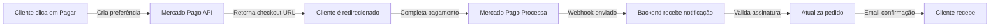

# 🔐 Admin Panel & Webhooks - Guia de Acesso

## 📋 Índice
1. [Admin Panel](#admin-panel)
2. [Webhooks](#webhooks)
3. [Mercado Pago Integration](#mercado-pago-integration)
4. [Troubleshooting](#troubleshooting)

---

## Admin Panel

### 🔑 Credenciais Padrão

```
URL: http://localhost:3000/admin
Email: admin@primestore.com
Senha: Admin@123456 (ALTERE NA PRIMEIRA VEZ!)
```

### 📊 Funcionalidades do Admin

#### Dashboard
- **KPIs Principais**
  - Total de receita (últimos 30 dias)
  - Total de pedidos
  - Número de clientes
  - Taxa de conversão
  - Produtos mais vendidos

- **Acesso**: `GET /api/admin/dashboard?days=30`

#### Gerenciamento de Produtos
- Listar todos os produtos
- Criar novo produto
- Editar produto (nome, preço, descrição, stock)
- Deletar produto
- Filtrar por categoria, status, busca

**Endpoints**:
```
GET    /api/admin/products              # Listar
PUT    /api/admin/products/:id          # Atualizar
DELETE /api/admin/products/:id          # Deletar
```

#### Gerenciamento de Pedidos
- Listar pedidos com filtros
- Visualizar detalhes do pedido
- Atualizar status do pedido
- Rastrear pagamento
- Imprimir etiqueta de envio

**Endpoints**:
```
GET    /api/admin/orders                        # Listar
PATCH  /api/admin/orders/:id/status             # Atualizar status
PATCH  /api/admin/orders/:id/payment-status     # Atualizar pagamento
```

#### Gerenciamento de Cupons
- Criar cupons de desconto
- Editar cupons existentes
- Deletar cupons expirados
- Visualizar uso de cupons

**Endpoints**:
```
GET    /api/admin/coupons              # Listar
POST   /api/admin/coupons              # Criar
PUT    /api/admin/coupons/:id          # Atualizar
DELETE /api/admin/coupons/:id          # Deletar
```

#### Gerenciamento de Fornecedores (Dropshipping)
- Registrar novo fornecedor
- Editar dados do fornecedor
- Sincronizar pedidos com fornecedor
- Ver performance do fornecedor
- Gerenciar custos de envio

**Endpoints**:
```
GET    /api/suppliers                  # Listar
POST   /api/suppliers                  # Criar
PUT    /api/suppliers/:id              # Atualizar
GET    /api/suppliers/:id/performance  # Performance
```

#### Configurações da Loja
- Nome da loja
- Email de contato
- Telefone
- Redes sociais
- Políticas (privacidade, termos, devolução)
- Taxas e frete padrão

**Endpoints**:
```
GET    /api/admin/settings             # Obter
PUT    /api/admin/settings             # Atualizar
```

### 🔒 Proteção de Rotas

Todas as rotas admin requerem:
1. **Autenticação JWT** válida
2. **Role ADMIN** ou **SUPERADMIN**

Headers necessário:
```
Authorization: Bearer <seu_token_jwt>
```

---

## Webhooks

### 📡 Endpoints Disponíveis

#### 1. Mercado Pago Webhook
```
POST /api/webhooks/mercadopago
Content-Type: application/json

{
  "id": "notification_id",
  "type": "payment",
  "data": {
    "id": "payment_id"
  }
}
```

**O que acontece**:
- Recebe notificação de pagamento do Mercado Pago
- Atualiza status do pagamento no banco
- Atualiza status do pedido para CONFIRMED se aprovado
- Envia email de confirmação ao cliente

#### 2. Stripe Webhook
```
POST /api/webhooks/stripe
Content-Type: application/json

{
  "id": "evt_...",
  "type": "payment_intent.succeeded",
  "data": {
    "object": {
      "id": "pi_..."
    }
  }
}
```

#### 3. Webhook de Teste
```
POST /api/webhooks/test
Content-Type: application/json

{
  "test": true,
  "message": "Teste de webhook"
}
```

**Resposta Esperada** (200 OK):
```json
{
  "success": true,
  "message": "Webhook recebido com sucesso",
  "timestamp": "2026-02-13T10:30:00Z"
}
```

---

## Mercado Pago Integration

### 🔧 Configuração no Mercado Pago

#### 1. Obter Access Token

1. Acesse [Mercado Pago Developer](https://www.mercadopago.com.br/developers)
2. Faça login com sua conta
3. Vá em **Credenciais**
4. Copie o **Access Token** (começará com `APP_USR_...`)
5. Cole em `backend/.env`:
   ```
   MP_ACCESS_TOKEN=APP_USR_xxxxxxxxxxxxxxxxxxxxx
   ```

#### 2. Configurar Webhook

No painel do Mercado Pago:

1. Vá em **Suas Integrações** → **Webhooks**
2. Clique em **Adicionar novo webhook**
3. **URL**: `https://api.seu-dominio.com/api/webhooks/mercadopago`
4. **Eventos**: Marque as opções:
   - ✅ payment.created
   - ✅ payment.updated
   - ✅ merchant_order.created
   - ✅ merchant_order.updated
5. Salve e copie o **Webhook Secret**
6. Cole em `backend/.env`:
   ```
   MERCADO_PAGO_WEBHOOK_SECRET=seu_webhook_secret
   ```

#### 3. Credenciais Suportadas

**Você pode usar:**
- **Produção**: Access Token da conta principal
- **Sandbox (testes)**: Access Token do sandbox do Mercado Pago

No código:
```javascript
const mp = new MercadoPagoConfig({
  accessToken: process.env.MP_ACCESS_TOKEN
});
```

### 💳 Fluxo de Pagamento


```mermaid
graph LR
    A["Cliente clica em Pagar"] -->|Cria preferência| B["Mercado Pago API"]
    B -->|Retorna checkout URL| C["Cliente é redirecionado"]
    C -->|Completa pagamento| D["Mercado Pago Processa"]
    D -->|Webhook enviado| E["Backend recebe notificação"]
    E -->|Valida assinatura| F["Atualiza pedido"]
    F -->|Email confirmação| G["Cliente recebe"]
```

---

## Testando Webhooks Localmente

### 📝 Com cURL

#### Teste Webhook Simples
```bash
curl -X POST http://localhost:5000/api/webhooks/test \
  -H "Content-Type: application/json" \
  -d '{"test":true, "message":"Teste webhook"}'
```

#### Simular Pagamento Mercado Pago (Sandbox)
```bash
curl -X POST http://localhost:5000/api/webhooks/mercadopago \
  -H "Content-Type: application/json" \
  -d '{
    "id": "notification_id_test",
    "type": "payment",
    "data": {
      "id": "123456789"
    }
  }'
```

### 🧪 Com Postman

1. Abra o Postman
2. Nova requisição `POST`
3. URL: `http://localhost:5000/api/webhooks/test`
4. Body (JSON):
   ```json
   {
     "test": true,
     "message": "Teste de webhook"
   }
   ```
5. Clique "Send"
6. Você deve receber:
   ```json
   {
     "success": true,
     "message": "Webhook recebido com sucesso",
     "timestamp": "2026-02-13T..."
   }
   ```

### 🐍 Com Python

```python
import requests
import json

# Webhook de teste
webhook_url = "http://localhost:5000/api/webhooks/test"
payload = {
    "test": True,
    "message": "Teste webhook Python"
}

response = requests.post(webhook_url, json=payload)
print(response.json())
```

---

## Troubleshooting

### ❌ Admin Painel Não Carrega

**Sintoma**: `404 Not Found` ou página em branco

**Solução**:
1. Verifique se frontend está rodando: `http://localhost:3000`
2. Abra DevTools (F12)
3. Vá em Console
4. Procure por erros de CORS ou fetch

```bash
# Reinicie frontend
cd frontend
npm run dev
```

### ❌ Login Falha com "Invalid Credentials"

**Sintoma**: Email e senha corretos mas nega acesso

**Solução**:
1. Verifique se o usuário admin foi criado:
   ```bash
   npx prisma studio  # Abre interface visual do banco
   ```
2. Se não existir, execute seed novamente:
   ```bash
   npm run seed
   ```
3. Limpe cookies do navegador

### ❌ Webhook Retorna 500 Error

**Sintoma**: POST /api/webhooks/test retorna erro interno

**Solução**:
1. Verifique se backend está rodando:
   ```bash
   curl http://localhost:5000/api/health
   ```
2. Veja logs do backend:
   ```bash
   # Terminal onde backend roda
   npm run dev
   ```
3. Verifique se banco de dados está acessível

### ⚠️ Webhook Não é Recebido

**Sintoma**: Envia webhook mas não é processado

**Solução**:
1. Verifique no log do backend se é recebido
2. Valide signature do webhook:
   - Mercado Pago envia um header especial
   - Backend deve validar com `MERCADO_PAGO_WEBHOOK_SECRET`
3. Certifique que URL webhook está correta em produção:
   - Teste com ngrok localmente:
     ```bash
     ngrok http 5000
     # Use URL fornecida em Mercado Pago
     ```

### 📊 Monitorar Webhooks em Tempo Real

Crie arquivo `monitor-webhooks.js`:
```javascript
const fs = require('fs');
const path = require('path');

// Monitora arquivo de log
const logFile = path.join(__dirname, 'backend/logs/webhook.log');

fs.watch(logFile, (eventType, filename) => {
  if (eventType === 'change') {
    const content = fs.readFileSync(logFile, 'utf8');
    console.clear();
    console.log('=== Logs de Webhook ===');
    console.log(content);
  }
});
```

---

## 🎯 Checklist de Configuração

- [ ] Admin panel acessível em `/admin`
- [ ] Login funciona com credenciais padrão
- [ ] Webhook teste retorna 200
- [ ] MP_ACCESS_TOKEN configurado no .env
- [ ] MERCADO_PAGO_WEBHOOK_SECRET configurado
- [ ] Webhook URL registrada no Mercado Pago
- [ ] Podem criar/editar/deletar produtos
- [ ] Podem atualizar status de pedidos
- [ ] Podem gerenciar cupons
- [ ] Podem gerenciar fornecedores

---

## 📚 Recursos Adicionais

- [Documentação Mercado Pago](https://www.mercadopago.com.br/developers/pt-BR)
- [Swagger API](http://localhost:5000/api-docs) (quando configurado)
- [Guia de Segurança](./SECURITY_PERFORMANCE_GUIDE.md)
- [Guia de Deployment](./DEPLOYMENT_INFRASTRUCTURE_GUIDE.md)
